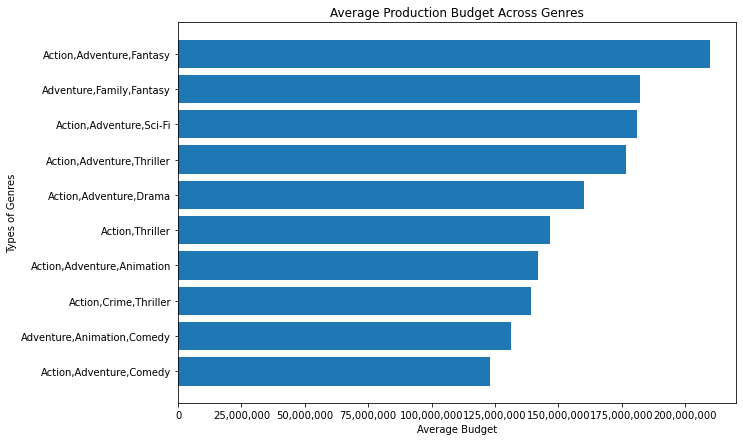
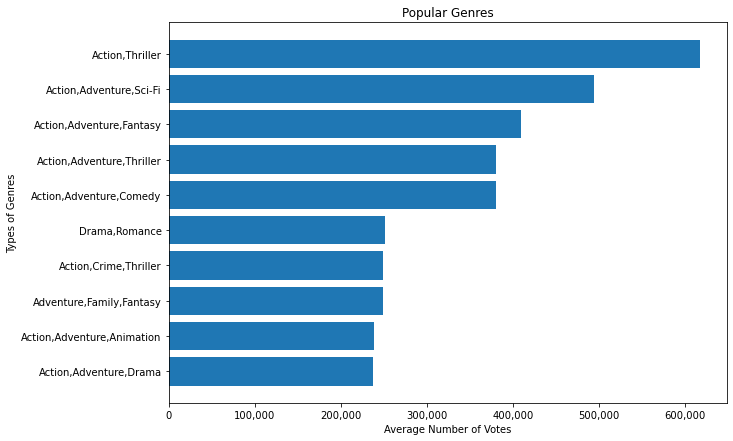
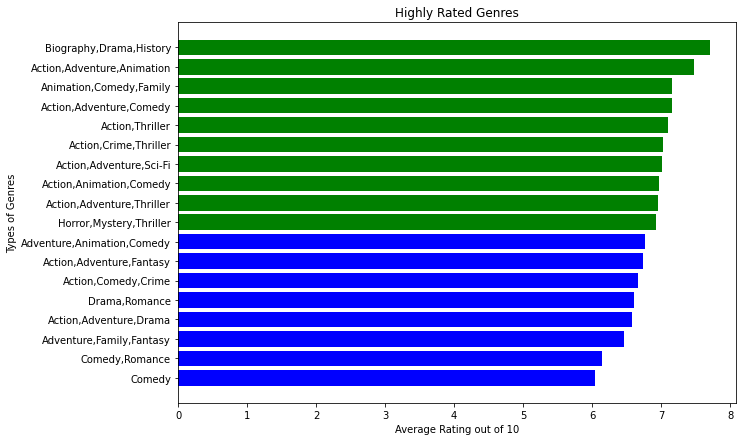
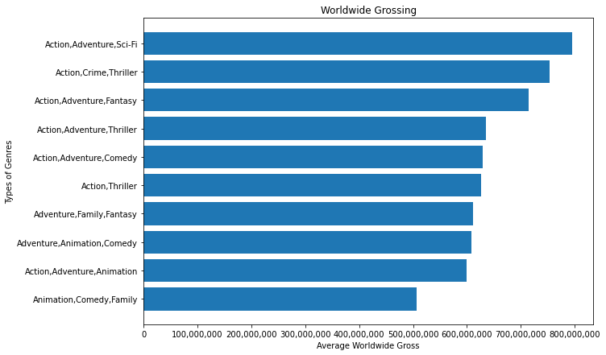

# Movie-Analysis-Project 

## Business Problem 

Microsoft Studios is a new comer to the already well established film business. They have everything they need to get started, but they lack a sense of direction and vision. This is where I come in and give them some suggestions from data I have acquired, cleaned, and ran to find trends that can guarantee Microsoft Studios a profitable start. I believe Microsoft Studios should aim to go big on their first film and focus on popularity to build an audience. To find the best way for Microsoft Studios to break into the movie industry, I organized my data around the goal of finding the genre with the highest average rating, highest number of votes, and highest average worldwide grossing. 

## Data Understanding

I used the data from [Box Office Mojo](https://www.boxofficemojo.com/), [The Numbers Movie Budget](https://www.the-numbers.com/), [Internet Movie Database](https://www.imdb.com/), and [The Movie Data Base](https://www.themoviedb.org/?language=en-US) to calculate the highest average rating, highest number of votes, and highest average worldwide grossing. 

## Data Preparation

Before I did any calculations, I cleaned the data by removing any duplicates and dropping any null values. After that, I filtered out any movie that did not gross at least $100 million domestically and overseas. The data in Box Office Mojo, specifically the domestic and foreign grossing values, had to be converted from strings to floats in order to merge it with The Numbers Movie Budget. 

## Findings

The findings from my research showed that the most popular movie genre, which I measured by average number of votes and average rating, is the combination of Action and Adventure. There were many different sub-genres of Action and Adventure such as Thriller, Sci-fi, Animation, Comedy, etc. I recommended Microsoft Studios to make an Action Adevnture film with a thriller aspect because they typically gross the highest compared to the other types of Action Adventure films and are towards the bottom in average production budget. 

 

